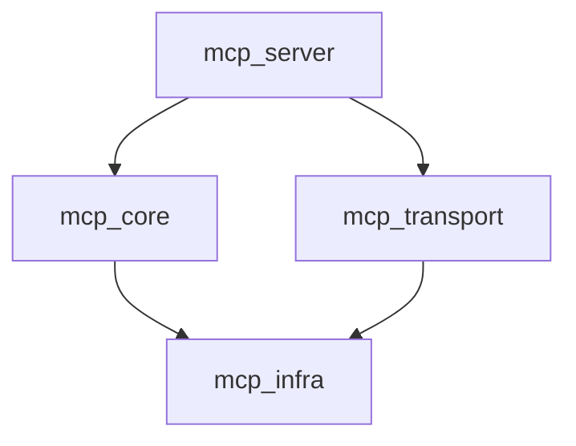

# Architecture Overview

The project is structured into several core modules to ensure separation of concerns and modularity.

## Modules

### `mcp_core`
Contains the core domain logic, repository patterns, and data models. It defines the business rules and entities of the system.

### `mcp_infra`
Handles infrastructure concerns such as configuration, logging, and exception handling. It provides the foundation upon which other modules build.

### `mcp_transport`
Implements the communication layers. Currently supports:
- **SSE (Server-Sent Events)**: For HTTP-based streaming.
- **Stdio**: For standard input/output communication, useful for CLI tools.

### `mcp_server`
The entry point for the application. It ties together the transport, core logic, and infrastructure to expose the agent's capabilities.
